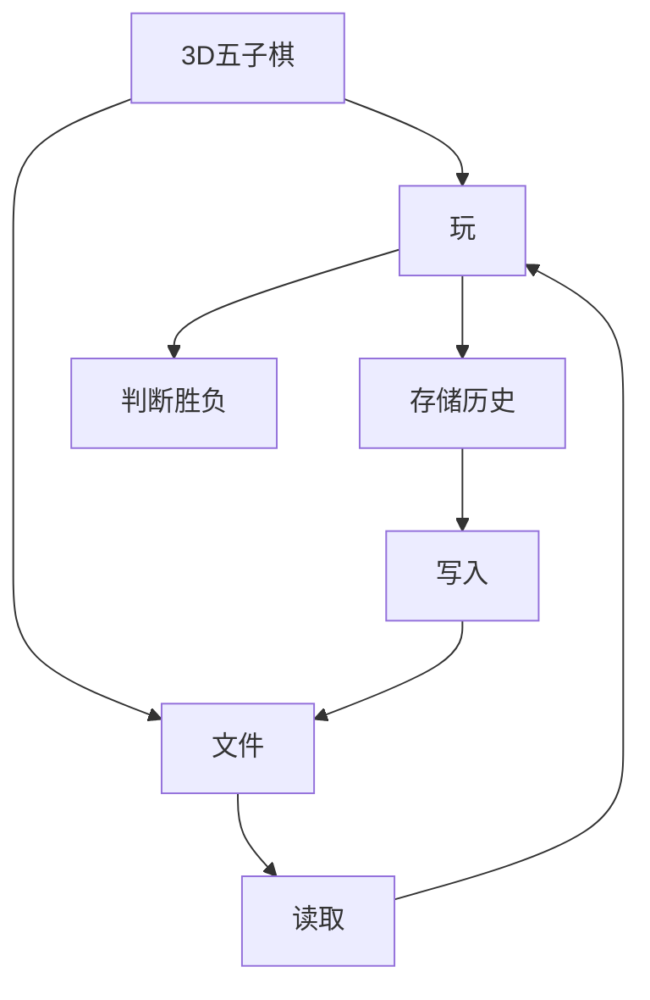
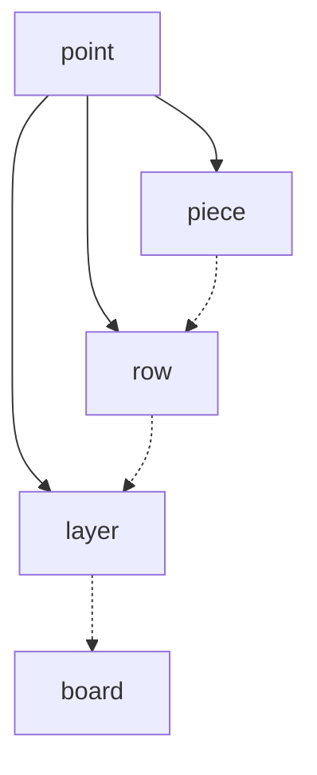
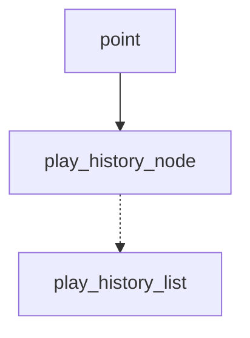

# 3D五子棋设计说明

- [系统需求分析](#系统需求分析)
- [总体设计](#总体设计)
- [详细设计](#详细设计)
	- [类层次结构](#类层次结构)
	- [模块](#模块)
- [系统调试](#系统调试)
	- [基本功能测试](#基本功能测试)
	- [关于调试](#关于调试)
- [结果分析](#结果分析)
- [总结](#总结)
- [附录](#附录)
	- [源代码](#源代码)
		- [game.h](#gameh)
		- [game.cpp](#gamecpp)
		- [play_history.h](#play_historyh)
		- [play_history.cpp](#play_historycpp)
		- [gameIO.h](#gameioh)
		- [gameIO.cpp](#gameiocpp)

## 系统需求分析

3D五子棋，即在欧几里得几何的三个维度上下五子棋，应具有最基本的可玩性，现简述如下：

1. 玩法：在xyz三个方向上各9个点位，即总共729个位置上轮流拜访黑白两种颜色的棋子，直到出现五个同色棋子连成沿 $x轴、y轴、z轴、x=\pm y、 y=\pm z、z=\pm x、x=\pm y=\pm z$ 的直线，游戏结束。即每个棋子周围的26个位置均可以用来连线；
2. 历史：考虑到悔棋的可能，需用某种数据结构来存储游戏历史，便于悔棋到先前的某步；
3. 存储：考虑到可能存在因故未完成的游戏，将下棋历史存储于文件后在读取可以实现继续游戏的功能；
4. 操作：最基础功能只实现通过命令行界面进行显示，通过键盘输入进行操作的办法。若有可能，会考虑利用主流游戏引擎进行3D界面的开发。

## 总体设计

3D五子棋分为三大部分：玩、历史的存储与读取、游戏的存储与读取，其中后两者的区别主要在于是否进行文件操作。

对于玩的部分，考虑一种分级存储的结构：3D棋盘 - 每层棋子 - 每列棋子 - 棋子。这样做的好处是编写时可以明确对何处的棋子进行操作，且规避了数组空间连续分布可能带来占用连续空间过大的问题。虽然链表同样可以实现，但是会加大开发难度，故舍弃。

由于游戏结束一定发生在最新的棋子落子的一刻，所以考虑在每一次落子之后从这颗棋子开始递归地寻找是否存在五子连线。一种类似的想法是每次落子后存储与之形成连线的棋子个数，这样每次落子后所需要寻找的次数减少至26及以下。但是这样做会增大空间开销，也会一定程度上加大开发难度。

对于历史部分，选择采用一个链表构成的栈结构，存储每一步的坐标。由于此游戏设计已经规定黑白的先后，所以只需追溯到相应步并调用方法改变棋子颜色即可实现悔棋。

对于文件存储部分，实际上是将存储历史的链表栈中的信息逐行写入文件。在读取的时候逐行的读取，并在写入新的历史后进行下棋的操作。



## 详细设计

### 类层次结构

与棋子相关的有五个类



对应类图为：
<!---->


与游戏历史相关的有三个类


对应类图为
<!---->


对于游戏的IO操作，由继承自`board`的`game_io`来进行，其下含有不同模块的方法和存储历史的链表。

```C++
class game_io : public board
{
public:
	game_io() = default;
	void run();
	void index();
	void play();
	void load();
	void save();
	play_history_list history;
};
```

### 模块

整体设计在`game_io`类中，由不同的方法实现各模块。其中`run()`负责整体的运行，`index()`负责显示主界面。其余部分分布在`play()`、`load()`、`save()`和`history`中。

play部分分为以下几个步骤：
1. 显示棋盘：由于三维的棋盘不能在命令行这样的二维平面上直接显示，所以将棋盘逐层显示，获得“伪3D”的效果。
2. 玩家决策：玩家可以选择 **“悔棋”**、**“下棋”**、**“存储”**，通过键入不同数字实现决策。**“悔棋”** 和 **“存储”** 见相应部分。
3. 选择下棋位置：玩家键入3D坐标后，系统在相应位置 **“落子”** ，并处理是否有赢家产生。如果游戏未结束，回到显示棋盘处。

load部分为主界面与 **“开始游戏”** 同级的另一选项，分为以下步骤：
1. 输入存储文件路径：进入load后需输入存储游戏的文件所在位置，之后系统从中读取并进行相应操作。
2. 进入play。

save部分为每次下棋的同时提供的选项，分为以下步骤：
1. 输入存储文件路径：进入save后需输入存储游戏的文件所在位置，之后系统向该文件写入必要信息。
2. 返回主菜单。

悔棋部分同样是每次下棋的同时提供的选项，分为以下步骤：
1. 输入悔棋步数：玩家可以输入不大于总步数的数字。
2. 系统执行：系统将倒退玩家输入的数字对应的步数。
3. 进入play。

## 系统调试

### 基本功能测试

下棋


棋盘的存储与载入


## 结果分析

github 上略

## 总结

github 上略

## 附录

GitHub: [duskmoon314/THUsummer2019](https://github.com/duskmoon314/THUsummer2019/tree/master/HumanResourceManagement)

### 源代码

> 本项目在 Microsoft Visual Studio Community 2019 上开发，使用 Visual C++ 2019，不保证使用其他环境可以正常编译以下源代码

> 在`main`函数中声明一个`game_io`类型变量，如`main`后，执行`main.run()`即可

#### game.h
> 棋子相关类的声明
```C++
#pragma once

#include <vector>
#include <iostream>
#include <fstream>

enum piece_color { none = 0, black = 1, white = 2 };

enum direction
{
	x_plus,
	x_minus,
	y_plus,
	y_minus,
	z_plus,
	z_minus,
	x_y_plus,
	x_y_minus,
	_x_y_plus,
	_x_y_minus,
	y_z_plus,
	y_z_minus,
	_y_z_plus,
	_y_z_minus,
	z_x_plus,
	z_x_minus,
	_z_x_plus,
	_z_x_minus,
	x_y_z_1_plus,
	x_y_z_1_minus,
	x_y_z_2_plus,
	x_y_z_2_minus,
	x_y_z_3_plus,
	x_y_z_3_minus,
	x_y_z_4_plus,
	x_y_z_4_minus
};

class point
{
public:
	point();
	point(const point& point);
	point(int z);
	point(int y, int z);
	point(int x, int y, int z);
	virtual ~point() = default;

	int get_x() const;
	int get_y() const;
	int get_z() const;

	friend std::ostream& operator<<(std::ostream& output, const point& point);
	virtual void print();
	virtual void write(std::fstream & fs);
protected:
	int x_, y_, z_;
};

//棋子
class piece : virtual public point
{
public:
	piece(int x, int y, int z);
	piece(const piece& piece);
	~piece() = default;

	void set_black();
	void set_white();
	void set_none();
	piece_color get_color() const;

	friend std::ostream& operator<<(std::ostream& output, piece& piece);
	void print() override;
	void write(std::fstream& fs) override;
protected:
	// 0 无子  1 黑  2 白
	piece_color color_ = none;
};

// 一行
class row : virtual public point
{
public:
	row(int y, int z);
	row(const row& row);
	~row() = default;

	piece& operator[](const int rank);
	friend std::ostream& operator<<(std::ostream& output, row& row);
	void print() override;
	void write(std::fstream& fs) override;
protected:
	std::vector<piece> pieces_;
};

//一层
class layer : virtual public point
{
public:
	layer(int z);
	layer(const layer& layer);
	~layer() = default;

	row& operator[](const int rank);
	piece& operator()(const int x, const int y);
	friend std::ostream& operator<<(std::ostream& output, layer& layer);
	void print() override;
	void write(std::fstream& fs) override;
protected:
	std::vector<row> rows_;
};

//棋盘
class board
{
public:
	board();
	~board() = default;

	layer& operator[](const int rank);
	row& operator()(const int y, const int z);
	piece& operator()(const int x, const int y, const int z);
	friend std::ostream& operator<<(std::ostream& output, board& board);

	piece_color check_win(const int x, const int y, const int z);
	int check_color(int x, int y, int z, direction dir, int count);
	void set_piece(int x, int y, int z, piece_color color);
protected:
	std::vector<layer> layers_;
};

```

#### game.cpp
> 棋子相关类的定义
```C++
#include "game.h"

point::point(): x_(0), y_(0), z_(0)
{
}

point::point(const point& point)
{
	x_ = point.x_;
	y_ = point.y_;
	z_ = point.z_;
}

point::point(const int z): x_(0), y_(0), z_(z)
{
}

point::point(const int y, const int z): x_(0), y_(y), z_(z)
{
}

point::point(const int x, const int y, const int z): x_(x), y_(y), z_(z)
{
}

int point::get_x() const
{
	return x_;
}

int point::get_y() const
{
	return y_;
}

int point::get_z() const
{
	return z_;
}

void point::print()
{
	std::cout << x_ << ' ' << y_ << ' ' << z_;
}

void point::write(std::fstream& fs)
{
	fs << *this;
}

piece::piece(const int x, const int y, const int z): point(x, y, z)
{
}

piece::piece(const piece& piece): point(piece)
{
	color_ = piece.color_;
}

void piece::set_black()
{
	color_ = black;
}

void piece::set_white()
{
	color_ = white;
}

void piece::set_none()
{
	color_ = none;
}

piece_color piece::get_color() const
{
	return color_;
}

void piece::print()
{
	std::cout << x_ << ' ' << y_ << ' ' << z_ << ' ' << *this;
}

void piece::write(std::fstream& fs)
{
	fs << x_ << ' ' << y_ << ' ' << z_ << ' ' << *this;
}

row::row(const int y, const int z): point(y, z)
{
	for (auto i = 0; i < 9; ++i)
	{
		pieces_.push_back(*(new piece(i, y, z)));
	}
}

row::row(const row& row)
	: point(row)
{
	pieces_ = row.pieces_;
}

piece& row::operator[](const int rank)
{
	return pieces_[rank - 1];
}

void row::print()
{
	std::cout << y_ << ' ' << z_ << ' ' << *this;
}

void row::write(std::fstream& fs)
{
	fs << y_ << ' ' << z_ << ' ' << *this;
}

layer::layer(const int z): point(z)
{
	for (auto i = 0; i < 9; ++i)
	{
		rows_.push_back(*(new row(i, z)));
	}
}

layer::layer(const layer& layer): point(layer)
{
	rows_ = layer.rows_;
}

row& layer::operator[](const int rank)
{
	return rows_[rank - 1];
}

piece& layer::operator()(const int x, const int y)
{
	return rows_[y - 1][x];
}

void layer::print()
{
	std::cout << z_ << '\n' << *this;
}

void layer::write(std::fstream& fs)
{
	fs << z_ << '\n' << *this;
}

board::board()
{
	for (auto i = 0; i < 9; ++i)
	{
		layers_.push_back(*(new layer(i)));
	}
}

layer& board::operator[](const int rank)
{
	return layers_[rank - 1];
}

row& board::operator()(const int y, const int z)
{
	return layers_[z - 1][y];
}

piece& board::operator()(const int x, const int y, const int z)
{
	return layers_[z - 1][y][x];
}

piece_color board::check_win(const int x, const int y, const int z)
{
	const auto color = (*this)(x, y, z).get_color();

	// 先沿x轴
	if (check_color(x, y, z, x_plus, 0) + check_color(x, y, z, x_minus, 0) >= 4)
	{
		return color;
	}

	// 再沿y轴
	if (check_color(x, y, z, y_plus, 0) + check_color(x, y, z, y_minus, 0) >= 4)
	{
		return color;
	}

	// 沿z轴
	if (check_color(x, y, z, z_plus, 0) + check_color(x, y, z, z_minus, 0) >= 4)
	{
		return color;
	}

	// y = x
	if (check_color(x, y, z, x_y_plus, 0) + check_color(x, y, z, x_y_minus, 0) >= 4)
	{
		return color;
	}

	// y = -x
	if (check_color(x, y, z, _x_y_plus, 0) + check_color(x, y, z, _x_y_minus, 0) >= 4)
	{
		return color;
	}

	// y = z
	if (check_color(x, y, z, y_z_plus, 0) + check_color(x, y, z, y_z_minus, 0) >= 4)
	{
		return color;
	}

	// y = -z
	if (check_color(x, y, z, _y_z_plus, 0) + check_color(x, y, z, _y_z_minus, 0) >= 4)
	{
		return color;
	}

	// x = z
	if (check_color(x, y, z, z_x_plus, 0) + check_color(x, y, z, z_x_minus, 0) >= 4)
	{
		return color;
	}

	// x = -z
	if (check_color(x, y, z, _z_x_plus, 0) + check_color(x, y, z, _z_x_minus, 0) >= 4)
	{
		return color;
	}

	// 体对角线
	if (check_color(x, y, z, x_y_z_1_plus, 0) + check_color(x, y, z, x_y_z_1_minus, 0) >= 4)
	{
		return color;
	}
	if (check_color(x, y, z, x_y_z_2_plus, 0) + check_color(x, y, z, x_y_z_2_minus, 0) >= 4)
	{
		return color;
	}
	if (check_color(x, y, z, x_y_z_3_plus, 0) + check_color(x, y, z, x_y_z_3_minus, 0) >= 4)
	{
		return color;
	}
	if (check_color(x, y, z, x_y_z_4_plus, 0) + check_color(x, y, z, x_y_z_4_minus, 0) >= 4)
	{
		return color;
	}
	return none;
}

int board::check_color(const int x, const int y, const int z, const direction dir, int count)
{
	const auto color = (*this)(x, y, z).get_color();
	switch (dir)
	{
	case x_plus:
		{
			if (x + 1 <= 9 && (*this)(x + 1, y, z).get_color() == color)
			{
				++count;
				if (count == 4) return count;
				return check_color(x + 1, y, z, dir, count);
			}
			return count;
		}
	case x_minus:
		{
			if (x - 1 > 0 && (*this)(x - 1, y, z).get_color() == color)
			{
				++count;
				if (count == 4) return count;
				return check_color(x - 1, y, z, dir, count);
			}
			return count;
		}
	case y_plus:
		{
			if (y + 1 <= 9 && (*this)(x, y + 1, z).get_color() == color)
			{
				++count;
				if (count == 4) return count;
				return check_color(x, y + 1, z, dir, count);
			}
			return count;
		}
	case y_minus:
		{
			if (y - 1 > 0 && (*this)(x, y - 1, z).get_color() == color)
			{
				++count;
				if (count == 4) return count;
				return check_color(x, y - 1, z, dir, count);
			}
			return count;
		}
	case z_plus:
		{
			if (z + 1 <= 9 && (*this)(x, y, z + 1).get_color() == color)
			{
				++count;
				if (count == 4) return count;
				return check_color(x, y, z + 1, dir, count);
			}
			return count;
		}
	case z_minus:
		{
			if (z - 1 > 0 && (*this)(x, y, z - 1).get_color() == color)
			{
				++count;
				if (count == 4) return count;
				return check_color(x, y, z - 1, dir, count);
			}
			return count;
		}
	case x_y_plus:
		{
			if (x + 1 <= 9 && y + 1 <= 9 && (*this)(x + 1, y + 1, z).get_color() == color)
			{
				++count;
				if (count == 4) return count;
				return check_color(x + 1, y + 1, z, dir, count);
			}
			return count;
		}
	case x_y_minus:
		{
			if (x - 1 > 0 && y - 1 > 0 && (*this)(x - 1, y - 1, z).get_color() == color)
			{
				++count;
				if (count == 4) return count;
				return check_color(x - 1, y - 1, z, dir, count);
			}
			return count;
		}
	case _x_y_plus:
		{
			if (x + 1 <= 9 && y - 1 > 0 && (*this)(x + 1, y - 1, z).get_color() == color)
			{
				++count;
				if (count == 4) return count;
				return check_color(x + 1, y - 1, z, dir, count);
			}
			return count;
		}
	case _x_y_minus:
		{
			if (x - 1 > 0 && y + 1 <= 9 && (*this)(x - 1, y + 1, z).get_color() == color)
			{
				++count;
				if (count == 4) return count;
				return check_color(x - 1, y + 1, z, dir, count);
			}
			return count;
		}
	case y_z_plus:
		{
			if (y + 1 <= 9 && z + 1 <= 9 && (*this)(x, y + 1, z + 1).get_color() == color)
			{
				++count;
				if (count == 4) return count;
				return check_color(x, y + 1, z + 1, dir, count);
			}
			return count;
		}
	case y_z_minus:
		{
			if (y - 1 > 0 && z - 1 > 0 && (*this)(x, y - 1, z - 1).get_color() == color)
			{
				++count;
				if (count == 4) return count;
				return check_color(x, y - 1, z - 1, dir, count);
			}
			return count;
		}
	case _y_z_plus:
		{
			if (y + 1 <= 9 && z - 1 > 0 && (*this)(x, y + 1, z - 1).get_color() == color)
			{
				++count;
				if (count == 4) return count;
				return check_color(x, y + 1, z - 1, dir, count);
			}
			return count;
		}
	case _y_z_minus:
		{
			if (y - 1 > 0 && z + 1 <= 9 && (*this)(x, y - 1, z + 1).get_color() == color)
			{
				++count;
				if (count == 4) return count;
				return check_color(x, y - 1, z + 1, dir, count);
			}
			return count;
		}
	case z_x_plus:
		{
			if (x + 1 <= 9 && z + 1 <= 9 && (*this)(x + 1, y, z + 1).get_color() == color)
			{
				++count;
				if (count == 4) return count;
				return check_color(x + 1, y, z + 1, dir, count);
			}
			return count;
		}
	case z_x_minus:
		{
			if (x - 1 > 0 && z - 1 > 0 && (*this)(x - 1, y, z - 1).get_color() == color)
			{
				++count;
				if (count == 4) return count;
				return check_color(x - 1, y, z - 1, dir, count);
			}
			return count;
		}
	case _z_x_plus:
		{
			if (x + 1 <= 9 && z - 1 > 0 && (*this)(x + 1, y, z - 1).get_color() == color)
			{
				++count;
				if (count == 4) return count;
				return check_color(x + 1, y, z - 1, dir, count);
			}
			return count;
		}
	case _z_x_minus:
		{
			if (x - 1 > 0 && z + 1 <= 9 && (*this)(x - 1, y, z + 1).get_color() == color)
			{
				++count;
				if (count == 4) return count;
				return check_color(x - 1, y, z + 1, dir, count);
			}
			return count;
		}
	case x_y_z_1_plus:
		{
			if (x + 1 <= 9 && y + 1 <= 9 && z + 1 <= 9 && (*this)(x + 1, y + 1, z + 1).get_color() == color)
			{
				++count;
				if (count == 4) return count;
				return check_color(x + 1, y + 1, z + 1, dir, count);
			}
			return count;
		}
	case x_y_z_1_minus:
		{
			if (x - 1 > 0 && y - 1 > 0 && z - 1 > 0 && (*this)(x - 1, y - 1, z - 1).get_color() == color)
			{
				++count;
				if (count == 4) return count;
				return check_color(x - 1, y - 1, z - 1, dir, count);
			}
			return count;
		}
	case x_y_z_2_plus:
		{
			if (x + 1 <= 9 && y + 1 <= 9 && z - 1 > 0 && (*this)(x + 1, y + 1, z - 1).get_color() == color)
			{
				++count;
				if (count == 4) return count;
				return check_color(x + 1, y + 1, z - 1, dir, count);
			}
			return count;
		}
	case x_y_z_2_minus:
		{
			if (x - 1 > 0 && y - 1 > 0 && z + 1 <= 9 && (*this)(x - 1, y - 1, z + 1).get_color() == color)
			{
				++count;
				if (count == 4) return count;
				return check_color(x - 1, y - 1, z + 1, dir, count);
			}
			return count;
		}
	case x_y_z_3_plus:
		{
			if (x + 1 <= 9 && y - 1 > 0 && z + 1 <= 9 && (*this)(x + 1, y - 1, z + 1).get_color() == color)
			{
				++count;
				if (count == 4) return count;
				return check_color(x + 1, y - 1, z + 1, dir, count);
			}
			return count;
		}
	case x_y_z_3_minus:
		{
			if (x - 1 > 0 && y + 1 <= 9 && z - 1 > 0 && (*this)(x - 1, y + 1, z - 1).get_color() == color)
			{
				++count;
				if (count == 4) return count;
				return check_color(x - 1, y + 1, z - 1, dir, count);
			}
			return count;
		}
	case x_y_z_4_plus:
		{
			if (x + 1 <= 9 && y - 1 > 0 && z - 1 > 0 && (*this)(x + 1, y - 1, z - 1).get_color() == color)
			{
				++count;
				if (count == 4) return count;
				return check_color(x + 1, y - 1, z - 1, dir, count);
			}
			return count;
		}
	case x_y_z_4_minus:
		{
			if (x - 1 > 0 && y + 1 <= 9 && z + 1 <= 9 && (*this)(x - 1, y + 1, z + 1).get_color() == color)
			{
				++count;
				if (count == 4) return count;
				return check_color(x - 1, y + 1, z + 1, dir, count);
			}
			return count;
		}
	default:
		return count;
	}
}

void board::set_piece(const int x, const int y, const int z, const piece_color color)
{
	if (color == black)
	{
		(*this)(x, y, z).set_black();
	}
	else
	{
		(*this)(x, y, z).set_white();
	}
}

std::ostream& operator<<(std::ostream& output, const point& point)
{
	output << point.x_ << ' ' << point.y_ << ' ' << point.z_;
	return output;
}

std::ostream& operator<<(std::ostream& output, piece& piece)
{
	if (piece.color_ == none)
	{
		output << "＋";
	}
	else if (piece.color_ == black)
	{
		output << "●";
	}
	else
	{
		output << "○";
	}
	return output;
}

std::ostream& operator<<(std::ostream& output, row& row)
{
	for (auto& piece : row.pieces_)
	{
		output << piece;
	}
	return output;
}

std::ostream& operator<<(std::ostream& output, layer& layer)
{
	output << "  1 2 3 4 5 6 7 8 9 x\n";
	auto count = 0;
	for (auto& row : layer.rows_)
	{
		++count;
		output << count;
		output << row << '\n';
	}
	output << "y\n";
	return output;
}

std::ostream& operator<<(std::ostream& output, board& board)
{
	auto count = 0;
	for (auto& layer : board.layers_)
	{
		++count;
		output << "第" << count << "层\n\n";
		output << layer;
		output << '\n';
	}
	return output;
}

```

#### play_history.h
> 游戏历史相关类的声明
```C++
#pragma once
#include "game.h"

class play_history_node : virtual public point
{
public:
	play_history_node(int r, point& piece_point);
	~play_history_node();
	void set_prev(play_history_node* prev_node);
	void set_prev(play_history_node& prev_node);
	void set_next(play_history_node* next_node);
	void set_next(play_history_node& next_point);
	play_history_node* get_prev() const;
	play_history_node* get_next() const;

protected:
	int rank_; //第几步
	play_history_node* prev_node_;
	play_history_node* next_node_;
};

class play_history_list
{
public:
	play_history_list();
	~play_history_list();

	void push(point& piece_point);
	point pop();
	void pop(int times);
	void history_pop(int times, board& board);
	int size() const;

	friend std::ostream& operator<<(std::ostream& output, const play_history_list& list);
	void write(std::fstream& fs);

private:
	int length_ = 0;
	play_history_node* head_;
	play_history_node* tail_;
};

```

#### play_history.cpp
> 游戏历史相关类的定义
```C++
#include "play_history.h"

play_history_node::play_history_node(const int r, point& piece_point): point(piece_point), rank_(r),
                                                                       prev_node_(nullptr), next_node_(nullptr)
{
}

play_history_node::~play_history_node() = default;

void play_history_node::set_prev(play_history_node* prev_node)
{
	prev_node_ = prev_node;
}

void play_history_node::set_prev(play_history_node& prev_node)
{
	prev_node_ = & prev_node;
}

void play_history_node::set_next(play_history_node* next_node)
{
	next_node_ = next_node;
}

void play_history_node::set_next(play_history_node& next_point)
{
	next_node_ = & next_point;
}

play_history_node* play_history_node::get_prev() const
{
	return prev_node_;
}

play_history_node* play_history_node::get_next() const
{
	return next_node_;
}

play_history_list::play_history_list(): head_(nullptr), tail_(nullptr)
{
}

play_history_list::~play_history_list()
{
	for (auto i = 0; i < length_; ++i)
	{
		this->pop();
	}
}

void play_history_list::push(point& piece_point)
{
	auto q = new play_history_node(++length_, piece_point);
	if (head_ == nullptr)
	{
		head_ = q;
		tail_ = q;
		q->set_prev(q);
		q->set_next(nullptr);
	}
	else
	{
		tail_->set_next(q);
		q->set_prev(tail_);
		tail_ = q;
	}
}

point play_history_list::pop()
{
	if (length_ <= 0)abort();
	const auto q = tail_;
	point point(q->get_x(), q->get_y(), q->get_z());
	tail_ = tail_->get_prev();
	tail_->set_next(nullptr);
	delete q;
	--length_;
	return point;
}

void play_history_list::pop(const int times)
{
	for (auto i = 0; i < times; ++i)
	{
		this->pop();
	}
}

void play_history_list::history_pop(const int times, board& board)
{
	for (auto i = 0; i < times; ++i)
	{
		auto point = pop();
		board(point.get_x(), point.get_y(), point.get_z()).set_none();
	}
}

int play_history_list::size() const
{
	return length_;
}

void play_history_list::write(std::fstream& fs)
{
	if (head_ == nullptr)return;
	auto temp = head_;
	do
	{
		temp->write(fs);
		fs << '\n';
		temp = temp->get_next();
	} while (temp != nullptr);
	return;
}

std::ostream& operator<<(std::ostream& output, const play_history_list& list)
{
	if (list.head_ == nullptr)return output;
	auto temp = list.head_;
	do
	{
		temp->print();
		output << '\n';
		temp = temp->get_next();
	}
	while (temp != nullptr);
	return output;
}

```

#### gameIO.h
> 游戏交互相关声明
```C++
#pragma once
#include "game.h"
#include "play_history.h"
#include <string>
#include <fstream>

class game_io : public board
{
public:
	game_io() = default;
	void run();
	void index();
	void play();
	void load();
	void save();
	play_history_list history;
};

```

#### gameIO.cpp
> 游戏交互相关定义
```C++
#include "gameIO.h"

void game_io::run()
{
	system("cls");
	
	while (true)
	{
		index();
		auto input = 0;
		std::cin >> input;
		if (input == 1)
		{
			play();
		}
		else if(input == 2)
		{
			load();
			play();
		}
		else if (input == 3)
		{
			return;
		}
		else {
			std::cout << "输入错误\n";
		}

	}
}

void game_io::index()
{
	system("cls");
	std::cout << "**********##########**********\n"
		<< "      一个简易的3D五子棋\n\n"
		<< "       Author: Duskmoon\n"
		<< "          作者： 暮月\n"
		<< "**********##########**********\n\n";

	std::cout << "输入1开始游戏，输入2载入游戏，输入3退出\n";
}

void game_io::play()
{
	auto color = 0;
	while (true)
	{
		system("cls");
		std::cout << *this;
		std::string str = color % 2 == 0 ? "黑方" : "白方";
		std::cout << "现在是" << str << "落子\n";
		std::cout << "已经落子共" << history.size() << "次\n"
			<< "若要悔棋请键入1，继续下棋键入2，存储游戏键入3：\n";
		auto input = 0;
		while (true)
		{
			std::cin >> input;
			if (input == 1)
			{
				std::cout << "请输入一个不大于" << history.size() << "的数字，将返回至输入步数之前\n";
				auto times = 0;
				while (true)
				{
					std::cin >> times;
					if (times > history.size())
					{
						std::cout << "输入错误\n";
					}
					else
					{
						history.history_pop(times, *this);
						break;
					}
				}
				break;
			}
			else if (input == 2)
			{
				int x, y, z;
				std::cout << "请输入直角坐标 1-9，用空格隔开，回车结束\n";
				std::cin >> x >> y >> z;

				point point(x, y, z);
				history.push(point);

				auto color_here = color % 2 == 0 ? black : white;
				(*this).set_piece(x, y, z, color_here);
				auto check = (*this).check_win(x, y, z);
				if (check != none)
				{
					std::cout << "Game Over\nWinner: ";
					if (check == black)
					{
						std::cout << "BLACK\n";
					}
					else
					{
						std::cout << "WHITE\n";
					}
					auto choice = 0;
					std::cout << "输入1返回主界面\n";
					while (true)
					{
						std::cin >> choice;
						if (choice == 1)
						{
							return;
						}
					}
				}
				++color;
				break;
			}
			else if(input ==3)
			{
				save();
				std::cout << "存储完毕，键入1返回主菜单\n";
				std::cin.ignore();
				auto input2 = 0;
				while(true)
				{
					std::cin >> input2;
					if(input2 == 1)
					{
						return;
					}
					std::cout << "输入错误\n";
				}
			}
			else
			{
				std::cout << "输入错误\n";
			}
		}
	}
}

void game_io::load()
{
	history.pop(history.size());
	system("cls");
	std::cout << "**********##########**********\n"
		<< "      一个简易的3D五子棋\n\n"
		<< "       Author: Duskmoon\n"
		<< "          作者： 暮月\n"
		<< "**********##########**********\n\n";

	std::cout << "请输入存储的游戏文件完整路径：\n";
	std::string file_name;
	std::cin >> file_name;
	std::fstream fs;
	fs.open(file_name.c_str(), std::ios::in);
	auto color = 0;
	while (fs.peek() != EOF) {
		int x, y, z;
		fs >> x >> y >> z;
		point point(x, y, z);
		history.push(point);

		auto color_here = color % 2 == 0 ? black : white;
		(*this).set_piece(x, y, z, color_here);
		auto check = (*this).check_win(x, y, z);
		if (check != none)
		{
			std::cout << "Game Over\nWinner: ";
			if (check == black)
			{
				std::cout << "BLACK\n";
			}
			else
			{
				std::cout << "WHITE\n";
			}
			auto choice = 0;
			std::cout << "输入1返回主界面\n";
			while (true)
			{
				std::cin >> choice;
				if (choice == 1)
				{
					return;
				}
			}
		}
		++color;
		fs.get();
	}
}

void game_io::save()
{
	std::cout << "请输入要存储的游戏文件完整路径：\n";
	std::string file_name;
	std::cin >> file_name;
	std::fstream fs;
	fs.open(file_name.c_str(), std::ios::out);
	history.write(fs);
	fs.close();
}

```
