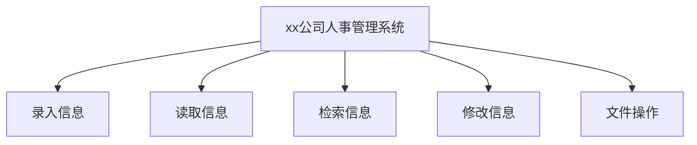
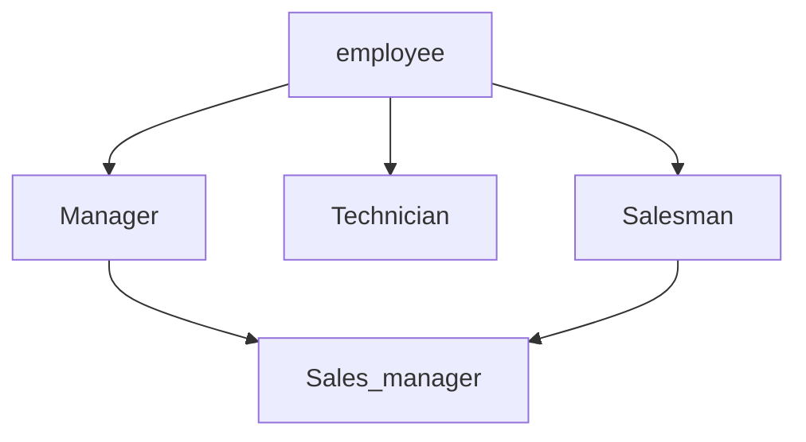
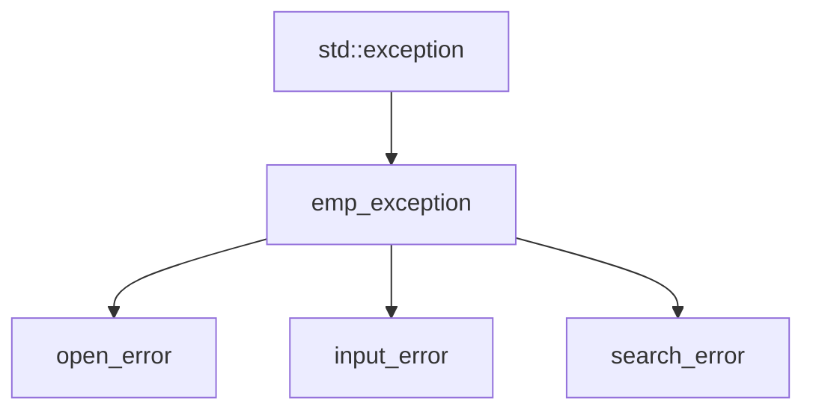
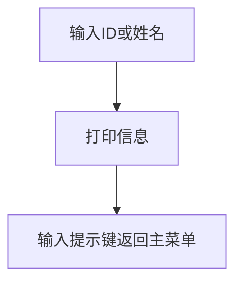
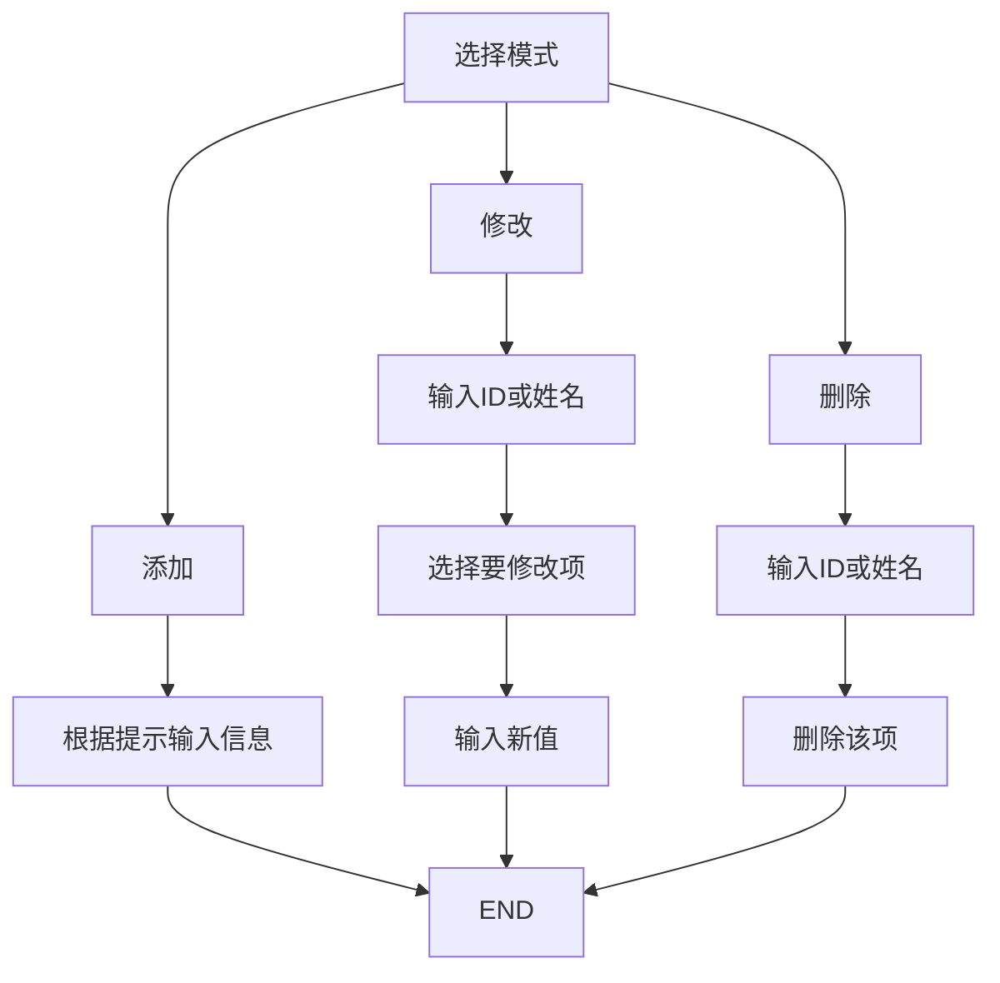

# xx公司人事管理系统设计说明 <!-- omit in toc -->

- [系统需求分析](#系统需求分析)
- [总体设计](#总体设计)
- [详细设计](#详细设计)
	- [类的层次结构](#类的层次结构)
	- [功能模块](#功能模块)
- [系统调试](#系统调试)
	- [基本功能测试](#基本功能测试)
- [结果分析](#结果分析)
- [总结](#总结)
- [附录](#附录)
	- [源代码](#源代码)
		- [emp.h](#emph)
		- [emp.cpp](#empcpp)
		- [empExp.h](#empexph)
		- [empIO.h](#empioh)
		- [empIO.cpp](#empiocpp)

## 系统需求分析

xx公司人事管理系统原为本学期作业，现进行整体重构。基本需求整理如下：

1. 记录员工的基本信息，包括 **ID**（由系统生成）、**姓名**、**职位**（包括经理、技术、销售、销售经理）、**等级**、**薪酬**等。对于部分职位如销售，应有**销售额**等信息；
2. 使用键盘进行输入操作，使用命令行进行显示，使用文本文件进行存储，并在此基础上实现各部分功能：
   - 录入信息：通过键盘以一定格式输入数据，然后存储到指定文件中；
   - 读取信息：读取指定文件中存储的信息并提供浏览功能；
   - 检索信息：通过**ID**或是**姓名**在存储的信息中进行检索并显示；
   - 修改信息：修改员工信息，包括增添、删除、更新（修改姓名、职位、等级、薪酬）；
   - 待定
3. 界面采用菜单分级的形式，通过输入进入相应菜单进行对应操作；

## 总体设计

人事管理系统包含录入、读取与浏览、检索、修改四大功能和必要的文件操作功能。

录入时根据系统提示逐项录入，或是提供接口有选择性地录入，完成后可以看到录入的信息并返回主菜单。

读取和浏览直接将文件中存储的所有数据显示在屏幕上，以一行一条数据并对齐的形式方便浏览。

检索时需要提供员工ID或是姓名，系统据此遍历存储的数据，找到时返回整条数据，未找到时返回错误信息。

修改包括增添、删除、更新。其中增添功能与录入基本一致，删除为删除某条数据，更新则是修改某条数据的某一部分，如改名、职位变更等。

必要的文件操作指选择要写入数据的文件，选择要读取数据的文件等。



## 详细设计

### 类的层次结构

人事管理系统涉及处理员工的五个类和处理异常的四个类，层次如下：

- 处理员工的类层次为：



相应类图为：
<!--
![员工类图](http://www.plantuml.com/plantuml/png/rLVDRjim33xNJo5qG91k_TbvROO-nEw6OYcfC5aA93f5q2NFFYagRSUcem8BXkqcaHyP-UD7Iddsm1qqjIv-AD2INLUQUoyzioicwussEodzTO5BzlJhxexLtF2rT0Ehvrhwu1gOGLOlHbKgEDxZUl0IKs4mvIluqeFZ5R3ZuLYR_wtumZRDKgkgjSrl7WbZPOs7TZkBAnAd3B2ruqBUiXJYmIcpdZ73wv5jOxq2PSra9YLksHzdt2e73TViqF_2-_iEy8Rix5lirYh1DixM5WASBTZNBY4DQeyPakSpynrcpMDTIFrXzAjJ8EUhu9Eydh6L7mLwuA2gVO8heq1nFM0aSIwXL69-anZkPKXS7_r8ztbKB1I1m1-9h17-T42FyVsg4zNjq4dvMwuREHSsWCx3NwtxMRxOnlbo8rrPMmCliPZdVwDPpXlZrTf8mOv2ZVZ5elWKzG2o0YawfYC0B71T1WMMnfQF7GxZZL1R9Pf93Ahhr8uiHr9e3rPeu4t4iEFNwbtaZBlT0BEqLhF0enB1iI-AD3fm0hqLYPnlBKte2c8QsTBymDqC5nJoRByJ0SIWo0GUC7AW-edcjrlfd1AI5WGsSmw5RKpX9XeNeQUdN3abZM0MaJR8beDrJq_ppjR0fe5RDibwNghls2J5VO7bx-wY_jtHMIEdb3cTf3FCUciw97ULH3VLl1FPK2KNo7heqluZ4ihS0MH8VW9UJ81qsSSol9fYVp2PhjBuYhGTCH4zX12IZZ-DUavonXTNNyneGocV6578k9srAmgSaJ1EuTwDHMV9IpUVxO3f_f-fXr3wRYS-zpA29SfBYdLyW0cPLhQkbVVn5dOSv4X_E6j78aG7Af7mu7bxjjdfTZhsOtfAlNDEe-Nm9hv0ueU7vCYy7zY22Qabo5meKL8oc0h5_msVSKKqLac_AV9TbUcclzD5qtZwjIikr6ePwGwvb5LCfGnyP-5CrWbbOZzXGJ_oh3d9FtfdJqgJXb6D_IoDQ6hz6m00)
-->

- 处理异常的类层次为：


相应类图为：
<!--

-->


### 功能模块

1. 录入
录入为系统运行时从默认的文件路径（目前为`D:/test.txt`）读取，不需要用户操作

2. 读取（浏览）
读取功能为直接将文件存储的信息显示在屏幕上，用户按屏幕提示的相应键后返回主菜单

3. 检索
检索根据**ID**和**姓名**进行搜索，流程如下：


4. 修改
修改分三部分：添加、修改、删除，流程大致如下


5. 文件操作
文件操作分两部分，一个是系统自动在更改后存储，另一个是用户手动更改当前操作的文件（通过修改路径的办法）


## 系统调试

### 基本功能测试

添加与浏览功能


修改与删除功能（这一部分包含与搜索高度相似的部分）


文件操作功能


## 结果分析

github上略

## 总结

github上略

## 附录

GitHub: [duskmoon314/THUsummer2019](https://github.com/duskmoon314/THUsummer2019/tree/master/HumanResourceManagement)

### 源代码

> 本项目在 Microsoft Visual Studio Community 2019 上开发，使用 Visual C++ 2019，不保证使用其他环境可以正常编译以下源代码

#### emp.h
> 员工相关类的声明

```C++
#pragma once
#ifndef EMP_H_
#define EMP_H_

#include <iostream>
#include <fstream>
#include <iomanip>
#include <string>
#include <vector>

using namespace std;

class employee
{
public:
	employee();
	employee(const employee& emp);
	employee(int grade, const string& name, const string& position);
	employee(int id, int grade, const string& name, const string& position);
	virtual ~employee();

	virtual void promote() = 0;
	virtual void promote(int grade);
	virtual void pay() = 0;
	virtual void print() = 0;
	virtual void write(fstream& fs) = 0;
	static void initial();

	int get_id() const;
	string get_position() const;
	string get_name() const;
	int get_grade() const;
	void set_name(string& name);
	virtual void set_sales_value(double);
	virtual void set_work_hours_per_month(int);
	virtual void set_sub(unsigned int it);

protected:
	static int total_emp_no_;
	int individual_emp_no_;
	int grade_;
	string name_;
	string position_;
	double monthly_salary_;
	bool valid_; //尝试通过用户使用逻辑限制前的合法性判断用数据
};

class manager : virtual public employee
{
public:
	manager();
	manager(const manager& manager);
	manager(int grade, const string& name);
	manager(int id, int grade, const string& name);
	~manager();

	virtual void promote() override;
	virtual void pay() override;
	virtual void print() override;
	void write(fstream& fs) override;

	friend ostream& operator<<(ostream& output, const manager& manager);

protected:
	static int total_manager_no_;
};

class technician : virtual public employee
{
public:
	technician();
	technician(const technician& technician);
	technician(int grade, const string& name, int work_hours_per_month);
	technician(int id, int grade, const string& name, int work_hours_per_month);
	~technician();
	virtual void promote() override;
	virtual void pay() override;
	virtual void print() override;
	virtual void write(fstream& fs) override;
	void set_work_hours_per_month(int) override;
	friend ostream& operator<<(ostream& output, const technician& technician);

protected:
	int work_hours_per_month_;
	double pay_per_hour_;
	static int total_tech_no_;
};

class salesman : virtual public employee
{
public:
	salesman();
	salesman(const salesman& salesman);
	salesman(int grade, const string& name, double sales_value);
	salesman(int id, int grade, const string& name, double sales_value);
	~salesman();
	virtual void promote() override;
	virtual void pay() override;
	virtual void print() override;
	void write(fstream& fs) override;
	void set_sales_value(double sales_value) override;
	friend ostream& operator<<(ostream& output, const salesman& salesman);
protected:
	double sales_value_;
	double commission_rate_;
};

class sales_manager final : public manager, public salesman
{
public:
	sales_manager();
	sales_manager(const sales_manager& sales_manager);
	sales_manager(int grade, const string& name, double total_sales_value);
	sales_manager(int id, int grade, const string& name, double total_sales_value);
	//sales_manager(const manager& manager);
	//sales_manager(const salesman& salesman);
	sales_manager(const employee* employee);
	~sales_manager();
	void promote() override;
	void pay() override;
	void print() override;
	void write(fstream& fs) override;
	void set_sales_value(double) override;
	void set_sub(unsigned int id) override;
	friend ostream& operator<<(ostream& output, const sales_manager& sales_manager);
	vector<int> subordinate_salesman;
protected:
	static int total_sales_manager_no_;
	double total_sales_value_;
	double commission_rate_;
};

#endif /* EMP_H_ */

```

#### emp.cpp
> 员工相关类的实现

```C++
#include "emp.h"

int employee::total_emp_no_ = 0;

/**
 * \brief 
 */
employee::employee()
{
	individual_emp_no_ = ++total_emp_no_;
	grade_ = 0;
	name_ = "";
	position_ = "";
	monthly_salary_ = 0;
	valid_ = false;
}

/**
 * \brief 
 * \param emp 
 */
employee::employee(const employee& emp)
{
	individual_emp_no_ = emp.individual_emp_no_;
	grade_ = emp.grade_;
	name_ = emp.name_;
	position_ = emp.position_;
	monthly_salary_ = emp.monthly_salary_;
	valid_ = emp.valid_;
}

/**
 * \brief 
 * \param {int} grade 
 * \param {string} name 
 * \param {string} position 
 */
employee::employee(const int grade, const string& name, const string& position)
{
	individual_emp_no_ = ++total_emp_no_;
	grade_ = grade;
	name_ = name;
	position_ = position;
	monthly_salary_ = 0;
	valid_ = false;
}

/**
 * \brief 
 * \param id 
 * \param grade 
 * \param name 
 * \param position 
 */
employee::employee(const int id, const int grade, const string& name, const string& position)
{
	individual_emp_no_ = id;
	++total_emp_no_;
	total_emp_no_ = id > total_emp_no_ ? id : total_emp_no_;
	grade_ = grade;
	name_ = name;
	position_ = position;
	monthly_salary_ = 0;
	valid_ = false;
}

employee::~employee()
{
}

/**
 * \brief 
 * \param grade 
 */
void employee::promote(const int grade)
{
	grade_ = grade - 1;
	promote();
}

/**
 * \brief 
 */
void employee::initial()
{
	total_emp_no_ = 1;
}

/**
 * \brief 
 * \return 
 */
int employee::get_id() const
{
	return individual_emp_no_;
}

/**
 * \brief 
 * \return 
 */
string employee::get_position() const
{
	return position_;
}

/**
 * \brief 
 * \return 
 */
string employee::get_name() const
{
	return name_;
}

/**
 * \brief 
 * \return 
 */
int employee::get_grade() const
{
	return grade_;
}

/**
 * \brief 
 * \param name 
 */
void employee::set_name(string& name)
{
	name_ = name;
}

void employee::set_sales_value(double)
{
}

void employee::set_work_hours_per_month(int)
{
}

void employee::set_sub(unsigned it)
{
}

int manager::total_manager_no_ = 0;

/**
 * \brief 
 */
manager::manager(): employee()
{
}

// * \brief 
// * \param manager 
// */
manager::manager(const manager& manager)
	: employee(manager)
{
	position_ = "Manager";
}

/**
 * \brief 
 * \param grade 
 * \param name 
 */
manager::manager(const int grade, const string& name): employee(grade, name, "Manager")
{
	++total_manager_no_;
	//monthly_salary_ = (double(grade_) - 1.0) * 2000 + 8000;
	(*this).manager::pay();
}

/**
 * \brief 
 * \param id 
 * \param grade 
 * \param name 
 */
manager::manager(const int id, const int grade, const string& name): employee(id, grade, name, "Manager")
{
	++total_manager_no_;
	//monthly_salary_ = (double(grade_) - 1.0) * 2000 + 8000;
	(*this).manager::pay();
}

/**
 * \brief 
 */
manager::~manager()
{
	--total_manager_no_;
}

/**
 * \brief 
 */
void manager::promote()
{
	++grade_;
}

/**
 * \brief 
 */
void manager::pay()
{
	monthly_salary_ = (double(grade_) - 1.0) * 2000 + 8000;
}

/**
 * \brief 
 */
void manager::print()
{
	using namespace std;
	cout << resetiosflags(ios::right) << setiosflags(ios::left);
	cout << setw(13) << position_ << ' ';
	cout << resetiosflags(ios::left) << setiosflags(ios::right);
	cout << setw(3) << individual_emp_no_ << ' ';
	cout << resetiosflags(ios::right) << setiosflags(ios::left);
	cout << setw(20) << name_ << ' ';
	cout << resetiosflags(ios::left) << setiosflags(ios::right);
	cout << setw(2) << grade_ << ' ' << setw(6) << monthly_salary_ << '\n';
}

/**
 * \brief 
 * \param fs 
 */
void manager::write(fstream& fs)
{
	fs << *this;
}


/**
 * \brief 
 * \param output 
 * \param manager 
 * \return 
 */
ostream& operator<<(ostream& output, const manager& manager)
{
	output << resetiosflags(ios::right) << setiosflags(ios::left);
	output << setw(13) << manager.position_ << ' ';
	output << resetiosflags(ios::left) << setiosflags(ios::right);
	output << setw(3) << manager.individual_emp_no_ << ' ';
	output << resetiosflags(ios::right) << setiosflags(ios::left);
	output << setw(20) << manager.name_ << ' ';
	output << resetiosflags(ios::left) << setiosflags(ios::right);
	output << setw(2) << manager.grade_ << ' ' << setw(6) << manager.monthly_salary_;
	return output;
}

int technician::total_tech_no_ = 0;

/**
 * \brief 
 */
technician::technician(): employee()
{
	position_ = "Technician";
	work_hours_per_month_ = 0;
	pay_per_hour_ = 0;
	++total_tech_no_;
}

/**
 * \brief 
 * \param technician 
 */
technician::technician(const technician& technician)
	: employee(technician)
{
	work_hours_per_month_ = technician.work_hours_per_month_;
	pay_per_hour_ = technician.pay_per_hour_;
}

/**
 * \brief 
 * \param grade 
 * \param name 
 * \param work_hours_per_month 
 */
technician::technician(const int grade, const string& name, const int work_hours_per_month):
	employee(grade, name, "Technician"),
	work_hours_per_month_(
		work_hours_per_month)
{
	++total_tech_no_;
	pay_per_hour_ = 260 * log10(10.0 * double(grade_));
	(*this).technician::pay();
}

/**
 * \brief 
 * \param id 
 * \param grade 
 * \param name 
 * \param work_hours_per_month 
 */
technician::technician(int id, const int grade, const string& name, const int work_hours_per_month) :
	employee(grade, name, "Technician"), work_hours_per_month_(work_hours_per_month)
{
	++total_tech_no_;
	pay_per_hour_ = 260 * log10(10.0 * double(grade_));
	(*this).technician::pay();
}

/**
 * \brief 
 */
technician::~technician()
{
	--total_tech_no_;
}

/**
 * \brief 
 */
void technician::promote()
{
	++grade_;
	pay_per_hour_ = 260 * log10(10.0 * double(grade_));
}

/**
 * \brief 
 */
void technician::pay()
{
	monthly_salary_ = pay_per_hour_ * work_hours_per_month_;
}

/**
 * \brief 
 */
void technician::print()
{
	cout << *this;
}

/**
 * \brief 
 * \param fs 
 */
void technician::write(fstream& fs)
{
	fs << *this;
}

/**
 * \brief 
 * \param work_hours_per_month 
 */
void technician::set_work_hours_per_month(const int work_hours_per_month)
{
	work_hours_per_month_ = work_hours_per_month;
}

/**
 * \brief 
 * \param output 
 * \param technician 
 * \return 
 */
ostream& operator<<(ostream& output, const technician& technician)
{
	output << resetiosflags(ios::right) << setiosflags(ios::left);
	output << setw(13) << technician.position_ << ' ';
	output << resetiosflags(ios::left) << setiosflags(ios::right);
	output << setw(3) << technician.individual_emp_no_ << ' ';
	output << resetiosflags(ios::right) << setiosflags(ios::left);
	output << setw(20) << technician.name_ << ' ';
	output << resetiosflags(ios::left) << setiosflags(ios::right);
	output << setw(2) << technician.grade_ << ' ' << setw(6) << technician.monthly_salary_ << ' ';
	output << setw(4) << technician.work_hours_per_month_ << ' ' << setw(6) << technician.pay_per_hour_;
	return output;
}

/**
 * \brief 
 */
salesman::salesman(): employee(), sales_value_(0), commission_rate_(0)
{
}

/**
 * \brief 
 * \param salesman 
 */
salesman::salesman(const salesman& salesman)
	: employee(salesman)
{
	sales_value_ = salesman.sales_value_;
	commission_rate_ = salesman.commission_rate_;
}

/**
 * \brief 
 * \param grade 
 * \param name 
 * \param sales_value 
 */
salesman::salesman(const int grade, const string& name, const double sales_value): employee(grade, name, "Salesman"),
                                                                                   sales_value_(sales_value)
{
	commission_rate_ = 0.05 * pow(1.05, double(grade_) - 1);
	(*this).salesman::pay();
}

/**
 * \brief 
 * \param id 
 * \param grade 
 * \param name 
 * \param sales_value 
 */
salesman::salesman(const int id, const int grade, const string& name, const double sales_value):
	employee(id, grade, name, "Salesman"),
	sales_value_(sales_value)
{
	commission_rate_ = 0.05 * pow(1.05, double(grade_) - 1);
	(*this).salesman::pay();
}

salesman::~salesman()
= default;

/**
 * \brief 
 */
void salesman::promote()
{
	++grade_;
	commission_rate_ = 0.05 * pow(1.05, double(grade_) - 1);
}

/**
 * \brief 
 */
void salesman::pay()
{
	monthly_salary_ = commission_rate_ * sales_value_;
}

/**
 * \brief 
 */
void salesman::print()
{
	cout << *this;
}

/**
 * \brief 
 * \param fs 
 */
void salesman::write(fstream& fs)
{
	fs << *this;
}

/**
 * \brief 
 * \param sales_value 
 */
void salesman::set_sales_value(const double sales_value)
{
	sales_value_ = sales_value;
}

/**
 * \brief 
 * \param output 
 * \param salesman 
 * \return 
 */
ostream& operator<<(ostream& output, const salesman& salesman)
{
	output << resetiosflags(ios::right) << setiosflags(ios::left);
	output << setw(13) << salesman.position_ << ' ';
	output << resetiosflags(ios::left) << setiosflags(ios::right);
	output << setw(3) << salesman.individual_emp_no_ << ' ';
	output << resetiosflags(ios::right) << setiosflags(ios::left);
	output << setw(20) << salesman.name_ << ' ';
	output << resetiosflags(ios::left) << setiosflags(ios::right);
	output << setw(2) << salesman.grade_ << ' ' << setw(6) << salesman.monthly_salary_ << ' ';
	output << setw(4) << salesman.commission_rate_ << ' ' << setw(6) << salesman.sales_value_;
	return output;
}

int sales_manager::total_sales_manager_no_ = 0;

/**
 * \brief 
 */
sales_manager::sales_manager(): employee(), total_sales_value_(0), commission_rate_(0)
{
	++total_sales_manager_no_;
}

/**
 * \brief 
 * \param sales_manager 
 */
sales_manager::sales_manager(const sales_manager& sales_manager)
	: employee(sales_manager), manager(sales_manager), salesman(sales_manager)
{
	total_sales_value_ = sales_manager.total_sales_value_;
	sales_manager::commission_rate_ = sales_manager.sales_manager::commission_rate_;
}

/**
 * \brief 
 * \param grade 
 * \param name 
 * \param total_sales_value 
 */
sales_manager::sales_manager(const int grade, const string& name, const double total_sales_value):
	employee(grade, name, "Sales_manager"), total_sales_value_(total_sales_value)
{
	++total_sales_manager_no_;
	commission_rate_ = 0.05 * pow(1.05, double(grade_) - 1);
	(*this).sales_manager::pay();
}

/**
 * \brief 
 * \param id 
 * \param grade 
 * \param name 
 * \param total_sales_value 
 */
sales_manager::sales_manager(int id, int grade, const string& name, double total_sales_value):
	employee(id, grade, name, "Sales_manager"), total_sales_value_(total_sales_value)
{
	++total_sales_manager_no_;
	commission_rate_ = 0.05 * pow(1.05, double(grade_) - 1);
	(*this).sales_manager::pay();
}

/**
 * \brief 
 * \param employee 
 */
sales_manager::sales_manager(const employee* employee): total_sales_value_(0)
{
	--total_emp_no_;
	individual_emp_no_ = employee->get_id();
	name_ = employee->get_name();
	grade_ = employee->get_grade();
	commission_rate_ = 0.05 * pow(1.05, double(grade_) - 1);
	(*this).sales_manager::pay();
}

/**
 * \brief 
 */
sales_manager::~sales_manager()
{
	--total_sales_manager_no_;
}

/**
 * \brief 
 */
void sales_manager::promote()
{
	++grade_;
	sales_manager::commission_rate_ = 0.04 * pow(1.05, double(grade_) - 1);
}

/**
 * \brief 
 */
void sales_manager::pay()
{
	monthly_salary_ = 8000 + 1000 * (double(grade_) - 1) + sales_manager::commission_rate_ * total_sales_value_;
}

/**
 * \brief 
 */
void sales_manager::print()
{
	cout << *this;
}

/**
 * \brief 
 * \param fs 
 */
void sales_manager::write(fstream& fs)
{
	fs << *this;
}

/**
 * \brief 
 * \param sales_value 
 */
void sales_manager::set_sales_value(const double sales_value)
{
	total_sales_value_ = sales_value;
}

/**
 * \brief 
 * \param id 
 */
void sales_manager::set_sub(const unsigned int id)
{
	subordinate_salesman.push_back(id);
}

/**
 * \brief 
 * \param output 
 * \param sales_manager 
 * \return 
 */
ostream& operator<<(ostream& output, const sales_manager& sales_manager)
{
	output << resetiosflags(ios::right) << setiosflags(ios::left);
	output << setw(13) << sales_manager.position_ << ' ';
	output << resetiosflags(ios::left) << setiosflags(ios::right);
	output << setw(3) << sales_manager.individual_emp_no_ << ' ';
	output << resetiosflags(ios::right) << setiosflags(ios::left);
	output << setw(20) << sales_manager.name_ << ' ';
	output << resetiosflags(ios::left) << setiosflags(ios::right);
	output << setw(2) << sales_manager.grade_ << ' ' << setw(6) << sales_manager.monthly_salary_ << ' ';
	output << setw(4) << sales_manager.commission_rate_ << ' ' << setw(6) << sales_manager.total_sales_value_ << ' ';
	output << '[';
	if (sales_manager.subordinate_salesman.empty())
		output << ']';
	else
	{
		for (const auto& salesman : sales_manager.subordinate_salesman)
		{
			output << salesman << ',';
		}
		output << "]";
	}
	return output;
}

```

#### empExp.h
> 异常处理

```C++
#pragma once

#include <iostream>
#include <string>
#include <exception>
#include <utility>

//姑且仅用于返回错误信息
//若有需求，考虑改进
class emp_exception : public std::exception
{
public:
	explicit emp_exception(std::string msg) : err_log_(std::move(msg))
	{
	}

	const char* what() const noexcept override
	{
		return err_log_.c_str();
	}

private:
	std::string err_log_;
};

class open_error : public emp_exception
{
public:
	open_error(const std::string& file_name) : emp_exception(("未打开" + file_name + "，可能文件不存在"))
	{
	}
};

class input_error : public emp_exception
{
public:
	input_error() : emp_exception("输入错误或不合规")
	{
	}
};

class search_error : public emp_exception
{
public:
	search_error(): emp_exception("未搜索到，可能不存在")
	{
	}
};

```

#### empIO.h
> 系统运行显示相关函数的声明

```C++
#pragma once
#ifndef EMPIO_H_
#define EMPIO_H_

#include <iostream>
#include <iomanip>
#include <fstream>
#include <vector>
#include <string>
#include <algorithm>
#include "emp.h"
#include "empExp.h"


auto run(std::string file_name) -> void;

auto index(std::string& file_name) -> void;
auto explore(const std::string& file_name) -> void;
auto modify(const std::string& file_name, vector<employee*>& employees) -> void;
auto search(const std::string& file_name, vector<employee*>& employees) -> void;
auto change_file(std::string &file_name) -> void;
auto save(std::string &file_name) -> void;

auto load(const std::string& file_name, vector<employee*>& employees) -> void;

auto mod_add(vector<employee*>& employees) -> void;
auto mod_delete(vector<employee*>& employees) -> void;
auto mod_modify(vector<employee*>& employees) -> void;

#endif /* EMPIO_H_ */
```
#### empIO.cpp
> 系统运行相关函数的实现

```C++
#include "empIO.h"
#include <utility>

fstream fs;

string enum_position[4] = {"Manager", "Salesman", "Technician", "Sales_manager"};

/**
 * \brief 
 * \param file_name 
 */
auto run(std::string file_name) -> void
{
	vector<employee*> employees;
	load(file_name, employees);
	while (true)
	{
		index(file_name);
		auto input = 0;
		std::cin >> input;
		switch (input)
		{
			//浏览功能
		case 1:
			explore(file_name);
			break;

			//修改功能
		case 2:
			modify(file_name, employees);
			break;

			//查询功能
		case 3:
			search(file_name, employees);
			break;

			//保存新文件
		case 4:
			save(file_name);
			load(file_name, employees);
			break;

			//选择文件
		case 5:
			change_file(file_name);
			load(file_name, employees);
			break;

			//退出
		case 6:
			//system("exit");
			return;

		default:
			std::cout << "输入错误\n";
			break;
		}
	}
}

/**
 * \brief 
 * \param file_name 
 */
auto index(std::string& file_name) -> void
{
	system("cls");
	std::cout << "##########**********##########**********##########\n"
		<< "                   人事管理系统                   \n"
		<< "##########**********##########**********##########\n";

	std::cout << "    This is a simple human resource management\n"
		<< "            这是一个简易的人事管理系统\n"
		<< "\n                 coded by duskmoon\n"
		<< "                    由暮月编写\n";

	std::cout << "\n~~~~~~~~~~~~~~~~~~~~~~~~~~~~~~~~~~~~~~~~~~~~~~~~~~\n"
		<< "\n                     HomePage                     \n"
		<< "                     1. 浏览\n"
		<< "                     2. 修改\n"
		<< "                     3. 查询\n"
		<< "                     4. 保存至新文件\n"
		<< "                     5. 选择文件\n"
		<< "                     6. 退出\n";

	std::cout << "             请输入序号以执行相应操作\n"
		<< "             当前操作文件：" << file_name << std::endl;

	std::cout << "\n~~~~~~~~~~~~~~~~~~~~~~~~~~~~~~~~~~~~~~~~~~~~~~~~~~\n";
}

/**
 * \brief 
 * \param file_name 
 */
auto explore(const std::string& file_name) -> void
{
	system("cls");
	std::cout << "##########**********##########**********##########\n"
		<< "                   人事管理系统                   \n"
		<< "##########**********##########**********##########\n"
		<< "                     浏览模式\n";

	try
	{
		fs.open(file_name.c_str(), std::ios::in);
		if (fs.is_open())
		{
			char content[200];
			auto is_empty = true;
			while (fs.peek() != EOF)
			{
				is_empty = false;
				fs.getline(content, 200);
				std::cout << content << '\n';
			}
			fs.close();
			if (is_empty)
			{
				cout << "空文件，请更换操作文件或使用修改模式添加对象\n";
			}
		}
		else
		{
			throw open_error(file_name);
		}
	}
	catch (open_error& o)
	{
		std::cerr << o.what() << '\n';
	}

	std::cout << "显示完毕\n输入1返回主界面：";

	auto input = 0;
	while (true)
	{
		try
		{
			std::cin >> input;
			if (input != 1)
			{
				throw input_error();
			}
			return;
		}
		catch (input_error& i)
		{
			std::cerr << i.what() << '\n';
		}
	}
}

/**
 * \brief 
 * \param file_name 
 * \param employees 
 */
auto modify(const std::string& file_name, vector<employee*>& employees) -> void
{
	system("cls");
	std::cout << "##########**********##########**********##########\n"
		<< "                   人事管理系统                   \n"
		<< "##########**********##########**********##########\n"
		<< "                     修改模式\n";

	std::cout << "                     1. 添加\n"
		<< "                     2. 删除\n"
		<< "                     3. 修改\n"
		<< "                     4. 返回\n";


	auto input = 0;
	while (true)
	{
		try
		{
			std::cin >> input;
			switch (input)
			{
			case 1:
				{
					mod_add(employees);
					try
					{
						fs.open(file_name.c_str(), std::ios::out);
						if (fs.is_open())
						{
							for (auto& it : employees)
							{
								it->write(fs);
								fs << '\n';
							}
							fs.close();
						}
						else
						{
							throw open_error(file_name);
						}
					}
					catch (open_error& o)
					{
						std::cerr << o.what() << '\n';
					}
					return;
				}
			case 2:
				{
					mod_delete(employees);
					try
					{
						fs.open(file_name.c_str(), std::ios::out);
						if (fs.is_open())
						{
							for (auto& it : employees)
							{
								it->write(fs);
								fs << '\n';
							}
							fs.close();
						}
						else
						{
							throw open_error(file_name);
						}
					}
					catch (open_error& o)
					{
						std::cerr << o.what() << '\n';
					}
					return;
				}
			case 3:
				{
					mod_modify(employees);
					try
					{
						fs.open(file_name.c_str(), std::ios::out);
						if (fs.is_open())
						{
							for (auto& it : employees)
							{
								it->write(fs);
								fs << '\n';
							}
							fs.close();
						}
						else
						{
							throw open_error(file_name);
						}
					}
					catch (open_error& o)
					{
						std::cerr << o.what() << '\n';
					}
					return;
				}
			case 4:
				{
					return;
				}
			default:
				{
					throw input_error();
				}
			}
		}
		catch (input_error& i)
		{
			std::cerr << i.what() << '\n';
		}
	}
}

/**
 * \brief 
 * \param file_name 
 * \param employees 
 */
auto search(const std::string& file_name, vector<employee*>& employees) -> void
{
	system("cls");
	std::cout << "##########**********##########**********##########\n"
		<< "                   人事管理系统                   \n"
		<< "##########**********##########**********##########\n"
		<< "                     查询模式\n";


	std::cout << "\n请输入要查询的id或姓名：\n";
	std::string target;
	std::cin >> target;
	auto find = false;
	try
	{
		if (isdigit(target[0]))
		{
			for (auto& it : employees)
			{
				if (it->get_id() == stoi(target))
				{
					find = true;
					it->print();
					std::cout << "显示完毕\n输入1返回主界面：";

					auto input = 0;
					while (true)
					{
						try
						{
							std::cin >> input;
							if (input != 1)
							{
								throw input_error();
							}
							return;
						}
						catch (input_error& i)
						{
							std::cerr << i.what() << '\n';
						}
					}
				}
			}
		}
		else
		{
			for (auto& it : employees)
			{
				if (it->get_name() == target)
				{
					find = true;
					it->print();
					std::cout << "显示完毕\n输入1返回主界面：";

					auto input = 0;
					while (true)
					{
						try
						{
							std::cin >> input;
							if (input != 1)
							{
								throw input_error();
							}
							return;
						}
						catch (input_error& i)
						{
							std::cerr << i.what() << '\n';
						}
					}
				}
			}
		}
		if (!find)
		{
			throw search_error();
		}
	}
	catch (search_error& s)
	{
		std::cerr << s.what() << '\n';
	}
}

/**
 * \brief 
 * \param file_name 
 */
auto change_file(std::string &file_name) -> void
{
	system("cls");
	std::cout << "##########**********##########**********##########\n"
		<< "                   人事管理系统                   \n"
		<< "##########**********##########**********##########\n"
		<< "                     选择文件\n";

	std::cout << "      当前操作文件为：" << file_name << '\n'
		<< "              确认更改？\n"
		<< "          1 (YES)  2 (NO)\n";

	auto input = 0;
	while (true)
	{
		try
		{
			std::cin >> input;
			if (input == 1)
			{
				std::cout << "请输入文件名，包含完整路径与后缀（建议使用txt），回车结束\n";
				char temp[300];
				std::cin.ignore();
				std::cin.getline(temp, 300);
				file_name = temp;
				return;
			}
			if (input == 2)
			{
				return;
			}
			throw input_error();
		}
		catch (input_error& i)
		{
			std::cerr << i.what() << '\n';
		}
	}
}

/**
 * \brief 
 * \param file_name 
 */
auto save(std::string &file_name) -> void
{
	system("cls");
	std::cout << "##########**********##########**********##########\n"
		<< "                   人事管理系统                   \n"
		<< "##########**********##########**********##########\n"
		<< "                   保存至新文件\n";

	std::cout << " 当前操作文件：" << file_name << std::endl;
	std::cout << " 请输入新文件路径\n";
	std::string new_file;
	std::cin >> new_file;
	std::ifstream in;
	std::ofstream out;
	try
	{
		in.open(file_name, std::ios::in);
		out.open(new_file, std::ios::out);
		if (!in.is_open())
		{
			throw open_error(file_name);
		}
		else if (!out.is_open())
		{
			throw open_error(new_file);
		}
		else
		{
			char temp[1000];
			while (in.peek() != EOF)
			{
				in.getline(temp, 1000);
				out << temp << std::endl;
			}
			in.close();
			out.close();
		}
	}
	catch (const open_error& e)
	{
		std::cerr << e.what() << '\n';
	}

	std::cout << "保存完毕，是否需要切换操纵新文件？\n1(YES) 2(NO)\n";
	auto choice = 0;
	try
	{
		while (true)
		{
			std::cin >> choice;
			if (choice == 1)
			{
				file_name = new_file;
				return;
			}
			if (choice == 2)
			{
				return;
			}
			throw input_error();
		}
	}
	catch (input_error& i)
	{
		std::cerr << i.what() << '\n';
	}
}

/**
 * \brief 
 * \param file_name 
 * \param employees 
 */
auto load(const std::string& file_name, vector<employee*>& employees) -> void
{
	employees.clear();
	try
	{
		fs.open(file_name.c_str(), std::ios::in);
		if (fs.is_open())
		{
			auto is_empty = true;
			auto count = 0;
			string position;
			while (fs.peek() != EOF)
			{
				++count;
				is_empty = false;

				fs >> position;
				if (!strcmp(position.c_str(), "Manager"))
				{
					int id, grade;
					string name;
					double monthly_salary;
					fs >> id >> name >> grade >> monthly_salary;
					employee* pemp = new manager(id, grade, name);
					employees.push_back(pemp);
				}
				else if (!strcmp(position.c_str(), "Technician"))
				{
					int id, grade, work_hours_per_month;
					double pay_per_hour, monthly_salary;
					string name;
					fs >> id >> name >> grade >> monthly_salary >> work_hours_per_month >> pay_per_hour;
					employee* pemp = new technician(id, grade, name, work_hours_per_month);
					employees.push_back(pemp);
				}
				else if (!strcmp(position.c_str(), "Salesman"))
				{
					int id, grade;
					double sales_value, commission_rate, monthly_salary;
					string name;
					fs >> id >> name >> grade >> monthly_salary >> commission_rate >> sales_value;
					employee* pemp = new salesman(id, grade, name, sales_value);
					employees.push_back(pemp);
				}
				else if (!strcmp(position.c_str(), "Sales_manager"))
				{
					int id, grade;
					double total_sales_value, commission_rate, monthly_salary;
					string name;
					fs >> id >> name >> grade >> monthly_salary >> commission_rate >> total_sales_value;
					employee* pemp = new sales_manager(id, grade, name, total_sales_value);
					char c;
					fs.get(c);
					while (fs.get(c) && (c == '[' || c == ',' && fs.peek()!=']'))
					{
						int i;
						fs >> i;
						pemp->set_sub(i);
					}
					employees.push_back(pemp);
				}
				else
				{
					// 不合规范的文件
				}
				if (count == 1)
				{
					employees[0]->initial();
				}
				fs.get();
				//if (fs.peek() == '\n')break;
			}
			fs.close();
			if (is_empty)
			{
				cout << "空文件，请更换操作文件或使用修改模式添加对象\n";
			}
		}
		else
		{
			throw open_error(file_name);
		}
	}
	catch (open_error& o)
	{
		std::cerr << o.what() << '\n';
	}
}

/**
 * \brief 
 * \param employees 
 */
auto mod_add(vector<employee*>& employees) -> void
{
	system("cls");
	std::cout << "##########**********##########**********##########\n"
		<< "                   人事管理系统                   \n"
		<< "##########**********##########**********##########\n"
		<< "                     修改模式\n"
		<< "                       添加\n";

	std::cout << "  请选择添加成员的职位：\n"
		<< "  1. Manager\n  2. Technician\n  3. Salesman\n  4. Sales_manager\n";
	try
	{
		auto input = 0;
		std::cin >> input;
		while (true)
		{
			switch (input)
			{
			case 1:
				{
					int grade;
					string name;
					std::cout << "\n请输入姓名: ";
					std::cin >> name;
					std::cout << "\n请输入等级: ";
					std::cin >> grade;
					employee* pemp = new manager(grade, name);
					employees.push_back(pemp);
					return;
				}
			case 2:
				{
					int grade, work_hours_per_month;
					string name;
					std::cout << "\n请输入姓名: ";
					std::cin >> name;
					std::cout << "\n请依次输入等级、每月工作时长: ";
					std::cin >> grade >> work_hours_per_month;
					employee* pemp = new technician(grade, name, work_hours_per_month);
					employees.push_back(pemp);
					return;
				}
			case 3:
				{
					int grade;
					double sales_value;
					string name;
					std::cout << "\n请输入姓名: ";
					std::cin >> name;
					std::cout << "\n请依次输入等级、销售额: ";
					std::cin >> grade >> sales_value;
					employee* pemp = new salesman(grade, name, sales_value);
					employees.push_back(pemp);
					return;
				}
			case 4:
				{
					int grade;
					double total_sales_value;
					string name;
					std::cout << "\n请输入姓名: ";
					std::cin >> name;
					std::cout << "\n请依次输入等级、总销售额: ";
					std::cin >> grade >> total_sales_value;
					employee* pemp = new sales_manager(grade, name, total_sales_value);
					std::cout << "\n请输入销售经理手下销售人员的id（正整数），以空格或回车隔开，任意字符结尾\n";
					unsigned int id;
					while (cin >> id)
					{
						pemp->set_sub(id);
					}
					cin.clear();
					
					employees.push_back(pemp);
					return;
				}
			default:
				{
					throw input_error();
				}
			}
		}
	}
	catch (input_error& i)
	{
		std::cerr << i.what() << '\n';
	}
}

/**
 * \brief 
 * \param employees 
 */
auto mod_delete(vector<employee*>& employees) -> void
{
	system("cls");
	std::cout << "##########**********##########**********##########\n"
		<< "                   人事管理系统                   \n"
		<< "##########**********##########**********##########\n"
		<< "                     修改模式\n"
		<< "                       删除";

	std::cout << "\n请输入要删除的id或姓名：\n";
	std::string target;
	std::cin >> target;
	auto find = false;
	try
	{
		if (isdigit(target[0]))
		{
			for (auto& it : employees)
			{
				if (it->get_id() == stoi(target))
				{
					find = true;
					it->print();
					std::cout << "确定删除吗？\n1 (YES)  2 (NO)\n";
					auto input = 0;
					try
					{
						while (true)
						{
							cin >> input;
							if (input == 1)
							{
								employees.erase(remove(employees.begin(), employees.end(), it), employees.end());
								return;
							}
							if (input == 2)
							{
								return;
							}
							throw input_error();
						}
					}
					catch (input_error& i)
					{
						std::cerr << i.what() << '\n';
					}
				}
			}
		}
		else
		{
			for (auto& it : employees)
			{
				if (it->get_name() == target)
				{
					find = true;
					std::cout << it;
					std::cout << "确定删除吗？\n1 (YES)  2 (NO)\n";
					auto input = 0;
					try
					{
						while (true)
						{
							cin >> input;
							if (input == 1)
							{
								employees.erase(remove(employees.begin(), employees.end(), it), employees.end());
								return;
							}
							if (input == 2)
							{
								return;
							}
							throw input_error();
						}
					}
					catch (input_error& i)
					{
						std::cerr << i.what() << '\n';
					}
				}
			}
		}
		if (!find)
		{
			throw search_error();
		}
	}
	catch (search_error& s)
	{
		std::cerr << s.what() << '\n';
	}
}

/**
 * \brief 
 * \param employees 
 */
auto mod_modify(vector<employee*>& employees) -> void
{
	system("cls");
	std::cout << "##########**********##########**********##########\n"
		<< "                   人事管理系统                   \n"
		<< "##########**********##########**********##########\n"
		<< "                     修改模式\n"
		<< "                       修改";

	std::cout << "\n请输入要修改的id或姓名：\n";
	std::string target;
	std::cin >> target;
	auto find = false;
	try
	{
		if (isdigit(target[0]))
		{
			for (auto& it : employees)
			{
				if (it->get_id() == stoi(target))
				{
					find = true;
					it->print();
					std::cout << "确定修改吗？\n1 (YES)  2 (NO)\n";
					auto input = 0;
					try
					{
						while (true)
						{
							std::cin >> input;
							if (input == 1)
							{
								//std::cout << "1 改名  2 改变等级  3其他\n";
								//Manager
								if (it->get_position() == enum_position[0])
								{
									auto input2 = 0;
									try
									{
										while (true)
										{
											std::cout << "1 改名  2 改变等级  3 升级为销售经理  4 返回\n";
											std::cin >> input2;
											if (input2 == 1)
											{
												std::cout << "请输入姓名: \n";
												string new_name;
												std::cin >> new_name;
												it->set_name(new_name);
												//return;
											}
											else if (input2 == 2)
											{
												std::cout << "请输入等级: \n";
												auto grade = 0;
												std::cin >> grade;
												it->promote(grade);
												it->pay();
											}
											else if (input2 == 3)
											{
												employee* pemp = new sales_manager(it);
												employees.insert(std::find(employees.begin(), employees.end(), it),
												                 pemp);
												employees.erase(remove(employees.begin(), employees.end(), it),
												                employees.end());
												cout << "已改变职位，按任意键后结束并返回\n";
												char c[1000];
												if (std::cin.getline(c, 1000))
												{
													return;
												}
											}
											else if (input2 == 4)
											{
												return;
											}
											else
											{
												throw input_error();
											}
										}
									}
									catch (input_error& i)
									{
										std::cerr << i.what() << '\n';
									}
								}
								//Salesman
								if (it->get_position() == enum_position[1])
								{
									auto input2 = 0;
									try
									{
										while (true)
										{
											std::cout << "1 改名  2 改变等级  3 改变销售额  4 升级为销售经理  5 返回\n";
											std::cin >> input2;
											if (input2 == 1)
											{
												std::cout << "请输入姓名: \n";
												string new_name;
												std::cin >> new_name;
												it->set_name(new_name);
												//return;
											}
											else if (input2 == 2)
											{
												std::cout << "请输入等级: \n";
												auto grade = 0;
												std::cin >> grade;
												it->promote(grade);
												it->pay();
											}
											else if (input2 == 3)
											{
												std::cout << "请输入销售额: \n";
												auto sales_value = 0.0;
												std::cin >> sales_value;
												it->set_sales_value(sales_value);
												it->pay();
											}
											else if (input2 == 4)
											{
												employee* pemp = new sales_manager(it);
												employees.insert(std::find(employees.begin(), employees.end(), it),
												                 pemp);
												employees.erase(remove(employees.begin(), employees.end(), it),
												                employees.end());
												cout << "已改变职位，按任意键后结束并返回\n";
												char c[1000];
												if (std::cin.getline(c, 1000))
												{
													return;
												}
											}
											else if (input2 == 5)
											{
												return;
											}
											else
											{
												throw input_error();
											}
										}
									}
									catch (input_error& i)
									{
										std::cerr << i.what() << '\n';
									}
								}
								if (it->get_position() == enum_position[2])
								{
									auto input2 = 0;
									try
									{
										while (true)
										{
											std::cout << "1 改名  2 改变等级  3 改变工作时长  4 返回\n";
											std::cin >> input2;
											if (input2 == 1)
											{
												std::cout << "请输入姓名: \n";
												string new_name;
												std::cin >> new_name;
												it->set_name(new_name);
												//return;
											}
											else if (input2 == 2)
											{
												std::cout << "请输入等级: \n";
												auto grade = 0;
												std::cin >> grade;
												it->promote(grade);
												it->pay();
											}
											else if (input2 == 3)
											{
												std::cout << "请输入月工作时长: \n";
												auto work_hours_per_month = 0;
												std::cin >> work_hours_per_month;
												it->set_work_hours_per_month(work_hours_per_month);
												it->pay();
											}
											else if (input2 == 4)
											{
												return;
											}
											else
											{
												throw input_error();
											}
										}
									}
									catch (input_error& i)
									{
										std::cerr << i.what() << '\n';
									}
								}
								if (it->get_position() == enum_position[3])
								{
									auto input2 = 0;
									try
									{
										while (true)
										{
											std::cout << "1 改名  2 改变等级  3 添加下属销售  4 返回\n";
											std::cin >> input2;
											if (input2 == 1)
											{
												std::cout << "请输入姓名: \n";
												string new_name;
												std::cin >> new_name;
												it->set_name(new_name);
												//return;
											}
											else if (input2 == 2)
											{
												std::cout << "请输入等级: \n";
												auto grade = 0;
												std::cin >> grade;
												it->promote(grade);
												it->pay();
											}
											else if (input2 == 3)
											{
												std::cout << "请输入销售经理手下销售人员的id（正整数），以空格或回车隔开，任意字符结尾\n";
												unsigned int id;
												while (cin >> id)
												{
													(*it).set_sub(id);
												}
												cin.clear();
											}
											else if (input2 == 4)
											{
												return;
											}
											else
											{
												throw input_error();
											}
										}
									}
									catch (input_error& i)
									{
										std::cerr << i.what() << '\n';
									}
								}
							}
							if (input == 2)
							{
								return;
							}
							throw input_error();
						}
					}
					catch (input_error& i)
					{
						std::cerr << i.what() << '\n';
					}
				}
			}
		}
		else
		{
			for (auto& it : employees)
			{
				if (it->get_id() == stoi(target))
				{
					find = true;
					it->print();
					std::cout << "确定修改吗？\n1 (YES)  2 (NO)\n";
					auto input = 0;
					try
					{
						while (true)
						{
							std::cin >> input;
							if (input == 1)
							{
								//Manager
								if (it->get_position() == enum_position[0])
								{
									auto input2 = 0;
									try
									{
										while (true)
										{
											std::cout << "1 改名  2 改变等级  3 升级为销售经理  4 返回\n";
											std::cin >> input2;
											if (input2 == 1)
											{
												std::cout << "请输入姓名: \n";
												string new_name;
												std::cin >> new_name;
												it->set_name(new_name);
												//return;
											}
											else if (input2 == 2)
											{
												std::cout << "请输入等级: \n";
												auto grade = 0;
												std::cin >> grade;
												it->promote(grade);
												it->pay();
											}
											else if (input2 == 3)
											{
												employee* pemp = new sales_manager(it);
												employees.insert(std::find(employees.begin(), employees.end(), it),
												                 pemp);
												employees.erase(remove(employees.begin(), employees.end(), it),
												                employees.end());
												cout << "已改变职位，按任意键后结束并返回\n";
												char c[1000];
												if (std::cin.getline(c, 1000))
												{
													return;
												}
											}
											else if (input == 4)
											{
												return;
											}
											else
											{
												throw input_error();
											}
										}
									}
									catch (input_error& i)
									{
										std::cerr << i.what() << '\n';
									}
								}
								if (it->get_position() == enum_position[1])
								{
									auto input2 = 0;
									try
									{
										while (true)
										{
											std::cout << "1 改名  2 改变等级  3 改变销售额  4 升级为销售经理  5 返回\n";
											std::cin >> input2;
											if (input2 == 1)
											{
												std::cout << "请输入姓名: \n";
												string new_name;
												std::cin >> new_name;
												it->set_name(new_name);
												//return;
											}
											else if (input2 == 2)
											{
												std::cout << "请输入等级: \n";
												auto grade = 0;
												std::cin >> grade;
												it->promote(grade);
												it->pay();
											}
											else if (input2 == 3)
											{
												std::cout << "请输入销售额: \n";
												auto sales_value = 0.0;
												std::cin >> sales_value;
												it->set_sales_value(sales_value);
												it->pay();
											}
											else if (input2 == 4)
											{
												employee* pemp = new sales_manager(it);
												employees.insert(std::find(employees.begin(), employees.end(), it),
												                 pemp);
												employees.erase(remove(employees.begin(), employees.end(), it),
												                employees.end());
												cout << "已改变职位，按任意键后结束并返回\n";
												char c[1000];
												if (std::cin.getline(c, 1000))
												{
													return;
												}
											}
											else if (input2 == 5)
											{
												return;
											}
											else
											{
												throw input_error();
											}
										}
									}
									catch (input_error& i)
									{
										std::cerr << i.what() << '\n';
									}
								}
								if (it->get_position() == enum_position[2])
								{
									auto input2 = 0;
									try
									{
										while (true)
										{
											std::cout << "1 改名  2 改变等级  3 改变工作时长  4 返回\n";
											std::cin >> input2;
											if (input2 == 1)
											{
												std::cout << "请输入姓名: \n";
												string new_name;
												std::cin >> new_name;
												it->set_name(new_name);
												//return;
											}
											else if (input2 == 2)
											{
												std::cout << "请输入等级: \n";
												auto grade = 0;
												std::cin >> grade;
												it->promote(grade);
												it->pay();
											}
											else if (input2 == 3)
											{
												std::cout << "请输入月工作时长: \n";
												auto work_hours_per_month = 0;
												std::cin >> work_hours_per_month;
												it->set_work_hours_per_month(work_hours_per_month);
												it->pay();
											}
											else if (input2 == 4)
											{
												return;
											}
											else
											{
												throw input_error();
											}
										}
									}
									catch (input_error& i)
									{
										std::cerr << i.what() << '\n';
									}
								}
								if (it->get_position() == enum_position[3])
								{
									auto input2 = 0;
									try
									{
										while (true)
										{
											std::cout << "1 改名  2 改变等级  3 添加下属销售  4 返回\n";
											std::cin >> input2;
											if (input2 == 1)
											{
												std::cout << "请输入姓名: \n";
												string new_name;
												std::cin >> new_name;
												it->set_name(new_name);
												//return;
											}
											else if (input2 == 2)
											{
												std::cout << "请输入等级: \n";
												auto grade = 0;
												std::cin >> grade;
												it->promote(grade);
												it->pay();
											}
											else if (input2 == 3)
											{
												std::cout << "请输入销售经理手下销售人员的id（正整数），以空格或回车隔开，任意字符结尾\n";
												unsigned int id;
												while (cin >> id)
												{
													(*it).set_sub(id);
												}
												cin.clear();
											}
											else if (input2 == 4)
											{
												return;
											}
											else
											{
												throw input_error();
											}
										}
									}
									catch (input_error& i)
									{
										std::cerr << i.what() << '\n';
									}
								}
							}
							if (input == 2)
							{
								return;
							}
							throw input_error();
						}
					}
					catch (input_error& i)
					{
						std::cerr << i.what() << '\n';
					}
				}
			}
		}
		if (!find)
		{
			throw search_error();
		}
	}
	catch (search_error& s)
	{
		std::cerr << s.what() << '\n';
	}
}

```
