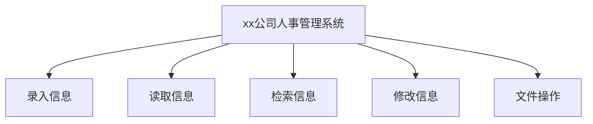

# xx公司人事管理系统设计说明 <!-- omit in toc -->

- [系统需求分析](#系统需求分析)
- [总体设计](#总体设计)
- [详细设计](#详细设计)
  - [类的层次结构](#类的层次结构)
- [系统调试](#系统调试)
- [结果分析](#结果分析)
- [总结](#总结)
- [附录](#附录)

## 系统需求分析

xx公司人事管理系统原为本学期作业，现进行整体重构。基本需求整理如下：

1. 记录员工的基本信息，包括 **ID**（由系统生成）、**姓名**、**职位**（包括经理、技术、销售、销售经理）、**等级**、**薪酬**等。对于部分职位如销售，应有**销售额**等信息；
2. 使用键盘进行输入操作，使用命令行进行显示，使用文本文件进行存储，并在此基础上实现各部分功能：
   - 录入信息：通过键盘以一定格式输入数据，然后存储到指定文件中；
   - 读取信息：读取指定文件中存储的信息并提供浏览功能；
   - 检索信息：通过**ID**或是**姓名**在存储的信息中进行检索并显示；
   - 修改信息：修改员工信息，包括增添、删除、更新（修改姓名、职位、等级、薪酬）；
   - 待定
3. 界面采用菜单分级的形式，通过输入进入相应菜单进行对应操作；

## 总体设计

人事管理系统包含录入、读取与浏览、检索、修改四大功能和必要的文件操作功能。

录入时根据系统提示逐项录入，或是提供接口有选择性地录入，完成后可以看到录入的信息并返回主菜单。

读取和浏览直接将文件中存储的所有数据显示在屏幕上，以一行一条数据并对齐的形式方便浏览。

检索时需要提供员工ID或是姓名，系统据此遍历存储的数据，找到时返回整条数据，未找到时返回错误信息。

修改包括增添、删除、更新。其中增添功能与录入基本一致，删除为删除某条数据，更新则是修改某条数据的某一部分，如改名、职位变更等。

必要的文件操作指选择要写入数据的文件，选择要读取数据的文件等。

## 详细设计

### 类的层次结构

## 系统调试

## 结果分析

## 总结

## 附录